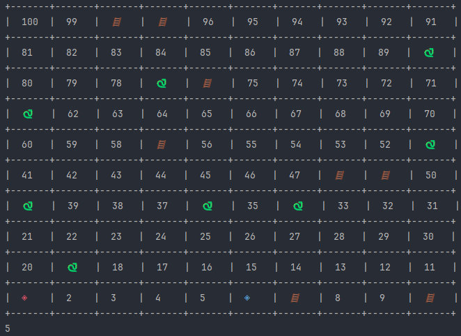

# Results of Testing

The test results show the actual outcome of the testing, following the [Test Plan](test-plan.md)

---

## Testing the board prints correctly

To print the board correctly, it must start with both players at square one and snakes and ladders thrown randomly around the board and then when the player rolls a die, move the player accordingly to the roll of the die.

### Test Data Used

I watched it print and first the board printed perfectly with no issues, 

### Test Result

The board printed perfectly

When I rolled a 2, i moved from square 1 to square 3
---

## Example Test Name

Example test description. Example test description.Example test description. Example test description.Example test description. Example test description.

### Test Data Used

Details of test data. Details of test data. Details of test data. Details of test data. Details of test data. Details of test data. Details of test data.

### Test Result

Comment on test result. Comment on test result. Comment on test result. Comment on test result. Comment on test result. Comment on test result.

---

