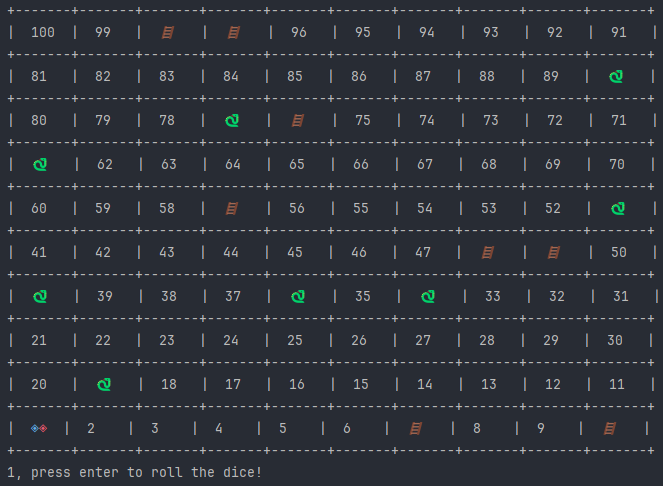

# Results of Testing

The test results show the actual outcome of the testing, following the [Test Plan](test-plan.md)

---

## Testing the board prints correctly

To print the board correctly, it must start with both players at square one and snakes and ladders thrown randomly around the board and then when the player rolls a die, move the player accordingly to the roll of the die.

### Test Data Used

I watched it print and first the board printed perfectly with no issues, then all of my other prints, worked the same and gave me exactly what it should have.

### Test Result

The board printed perfectly

Dice rolls printing works perfectly

---

## Testing the players move correctly

Making sure that the players move how they should with the roll of a die, and get moved by ladders and snakes.

### Test Data Used

I had my dice roll number print so I could see how many squares it was supposed to move me, it always worked. Whenever I landed on a snake, I went to a random value that was between 1 and 30 lower. When i was on a ladder i went up by a random number between 1 and 30. 

### Test Result

When I rolled a 5, I moved from square 1 to square 6 just like how it should

player 2 rolled a 6 and landed on a ladder and got moved up to 26

before roll

after roll

my snake perfectly moved me back
---

